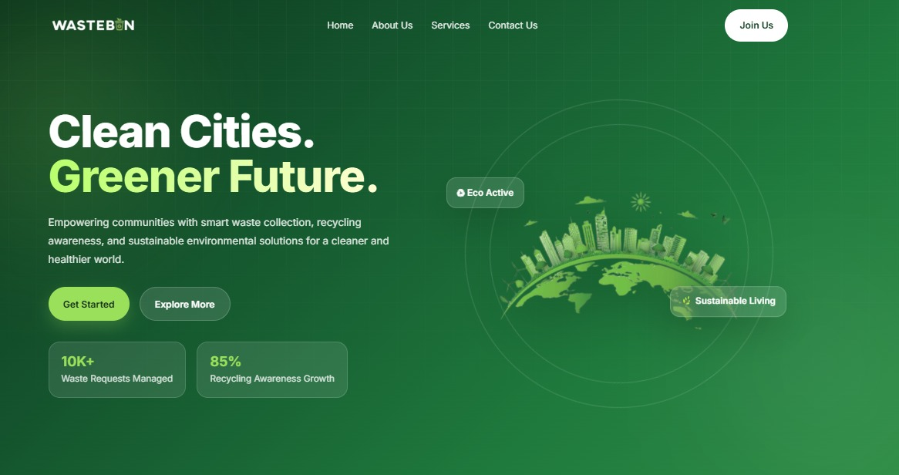

# WasteBin – Waste Management System



[](LICENSE)
[](https://www.php.net/)
[](https://www.mysql.com/)
[](#)

---

## Project Overview

**WasteBin** is a web-based platform designed to **streamline waste management** and promote environmental sustainability.
It allows users to:

* Schedule waste pickups
* Access recycling education and sorting guidance
* Submit feedback to improve services

The platform encourages **eco-friendly habits** and responsible waste disposal.

---

## Key Features

*  **Waste Collection Support** – Schedule pickups for various types of waste.
* **Recycling Education** – Guides users on proper recycling methods.
*  **Waste Sorting Guidance** – Separate organic, plastic, metal, glass, electronic, and mixed waste.
*  **Environmental Awareness** – Encourages sustainable living practices.
*  **Feedback System** – Submit feedback stored securely in the database.
*  **User Authentication** – Secure login for authorized users.
*  **Database Management** – Object-oriented PHP class for centralized database handling.

---

## Technologies Used

### Frontend

* HTML5, CSS3, JavaScript
* Bootstrap 5 & Bootstrap Icons
* Google Fonts (Inter)
* Lottie Animations (Preloader & Interactivity)

### Backend

* PHP (Core + Object-Oriented)
* MySQL Database
* Secure data handling with prepared statements

---

##  Project Structure

```
WasteBin/
│
├─ auth.php                  # Homepage with hero section and contact form
├─ request-pickup.php        # Waste pickup scheduling form
├─ dbconnection.php          # Database connection class
├─ navbar.php                # Reusable navigation bar
├─ signup.php                # User registration page
├─ signin.php                # User login page
├─ css/                      # Stylesheets
├─ js/                       # JavaScript files
├─ images/                   # Project images, icons, illustrations
└─ other static pages        # Waste collection, recycling, awareness
```

---

##  Database Configuration

* MySQL database named `wastebin`
* Two main tables:

  * **Feedback** – Stores user messages and suggestions.
  * **Request_pickup** – Stores user pickup requests including type, quantity, and address.
  * **user** – Stores user signup details.

---

##  How to Run the Project Locally

1. Install **XAMPP**, **WAMP**, or **LAMP** stack.
2. Place the project folder in the web server root (e.g., `htdocs`).
3. Start **Apache** and **MySQL**.
4. Import the `wastebin.sql` database file into **phpMyAdmin**.
5. Open a browser and go to:

   ```
   http://localhost/WasteBin/
   ```
6. Register or sign in to access pickup  features.

---

## Workflow

1. User logs in to access pickup requests.
2. Navigate to **Request Pickup** page.
3. Fill out the form: name, email, contact, waste type, quantity, and address.
4. Form validation ensures all fields are complete.
5. Data is stored securely in the database.
6. User sees a confirmation message after successful submission.


## Vision

Empowering communities to adopt **sustainable waste management practices** for cleaner, greener cities and a healthier planet.
